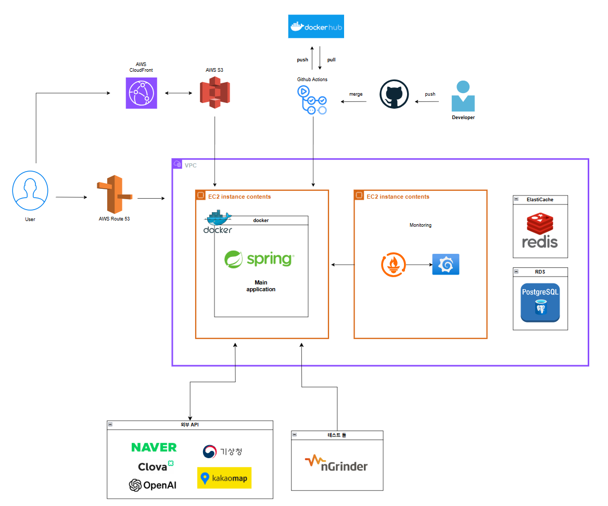
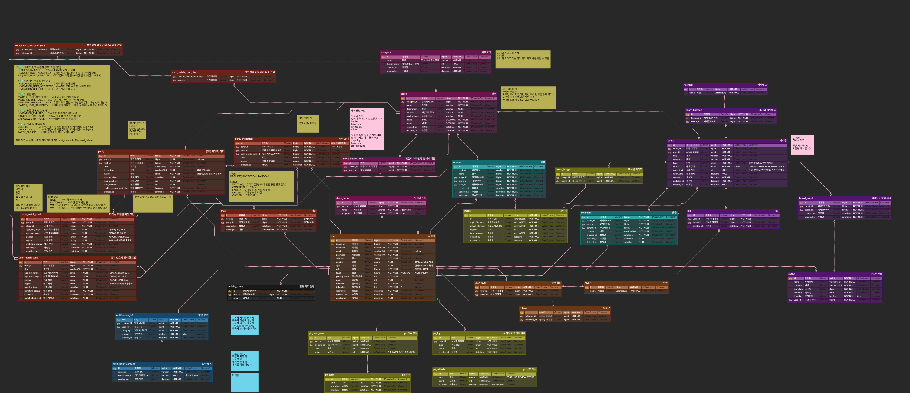
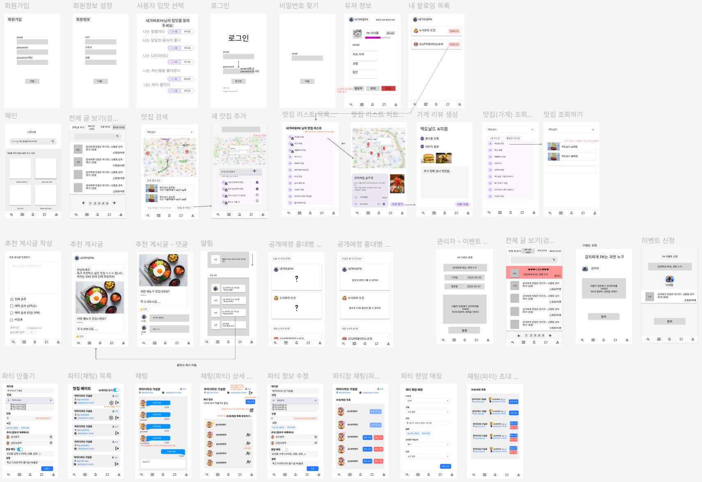
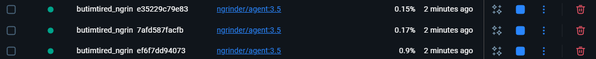
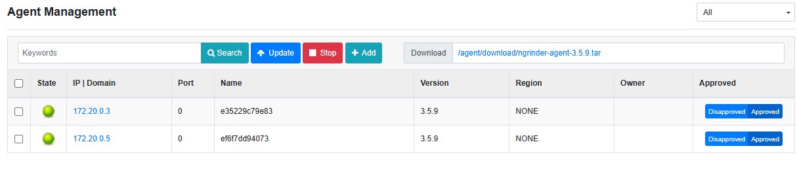
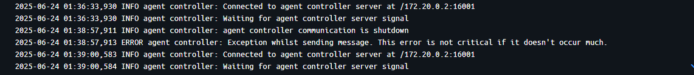
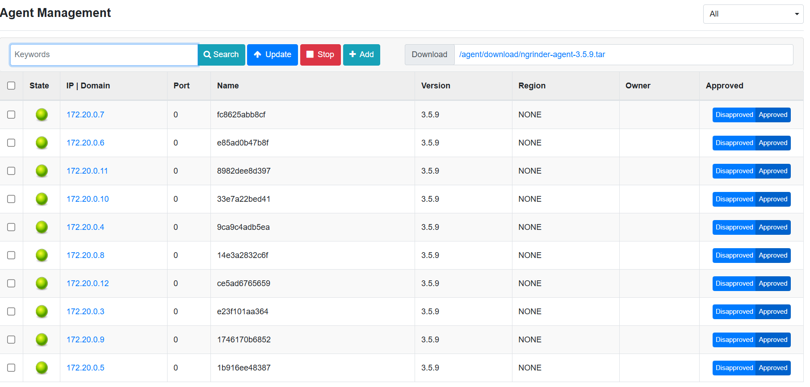

<br><br>

# 프로젝트 소개

MZ세대는 맛집 정보를 찾기 위해 여러 앱과 플랫폼을 번갈아 사용하지만, 정보가 분산되어 불편을 겪고 있습니다. 최근에는 가짜 리뷰, 신뢰할 만한 리스트 부족, 진정성 있는 커뮤니티에 대한 수요가 커지고 있습니다.

이를 해결하고자 **맛집 추천·맛집 메이트·진정성 기반 이벤트**를 결합한 **통합 맛집 공유 플랫폼 니맛내맛**을 기획했습니다.

<br><br>

## 시연 영상

**[🔗 시연 영상](https://www.youtube.com/watch?v=fmHCNejqKkg)**
<br><br>

## 배포

```java
배포 주소
```

<br><br>

## 프로젝트 실행 방법

<details>
<summary><strong>프로젝트 실행 방법</strong></summary>

### 1. 환경 요구사항

- Java 17 이상
- Gradle 8.x (프로젝트 버전: Gradle 8.14)
- Docker (선택: DB, Redis 로컬 실행 시)
- IDE: IntelliJ 권장

---

### 2. 실행 순서

```bash
# 1. 프로젝트 클론
git clone [레포지토리 주소]

# 2. 환경 변수 설정
cp .env.example .env # .env 파일에 DB 접속정보, S3 키 등 필수 값 입력

# 3. Docker로 필수 서비스 실행 (옵션)
docker-compose up -d

# 4. 애플리케이션 실행
./gradlew bootRun
```

</details>

<br><br>

# 목차

- [프로젝트 소개](#프로젝트-소개)
- [설치 및 실행 방법](#설치-및-실행-방법)
- [주요 기능](#주요-기능)
- [기술 스택](#기술-스택)
- [아키텍처](#아키텍처)
- [설계](#설계)
- [기술적 의사결정](#기술적-의사결정)
- [성능 개선](#성능-개선)
- [트러블 슈팅](#트러블-슈팅)
- [회고](#회고)
- [팀원 소개](#팀원-소개)

## 주요 기능

<details>
<summary>🕐 <strong>오픈런 게시글 기능</strong></summary>

* **도입 배경 및 문제 인식**

    * 맛집 추천 게시글을 <strong>선착순 또는 특정 시간에 한정하여 공개</strong>하여 일반 게시글보다 희소성 있는 정보 제공
    * 동시 요청 폭증, 공개 조건 위반, 순서 오류 등 <strong>동시성 이슈</strong>가 핵심
* **기술적 대응**

    * <strong>Redis Sorted Set + Redisson:</strong> 선착순 공개 게시글의 <strong>접근 순서 보장 및 락 기반 동시성 제어</strong>
    * <strong>In-memory Cache:</strong> 특정 시간에 자동 공개되는 게시글에 대해 <strong>조회 부하 분산 및 접근 타이밍 동기화</strong>
    * <strong>Spring Batch + Quartz:</strong> 게시글 조건 만료 시 자동 비공개 처리, 예약 실행 기반 유지관리 자동화

</details>

<details>
<summary>🔍 <strong>맛집 검색 및 추천 시스템</strong></summary>

* **도입 배경 및 문제 인식**

    * 사용자의 핵심 행동은 <strong>맛집을 검색하고, 내 리스트에 추가하거나 추천하는 행위</strong>입니다.
    * 단순한 SQL LIKE 검색은 정확도가 낮고, 유사 키워드 검색이나 오타 검색에 취약합니다.
    * 지역 기반 맛집 추천 시 <strong>거리, 키워드, 인기도 등 다양한 필터</strong>가 동시에 적용되어야 하며, RDB만으로는 고성능 대응이 어렵습니다.
* **기술적 대응**

    * <strong>Redis 캐시 계층 도입:</strong> 자주 검색되는 인기 맛집/지역은 TTL 캐싱으로 응답 속도 개선
    * <strong>Batch 처리:</strong> 월간 인기 검색 통계는 배치 작업을 통해 정리하고, Redis 캐시로 노출
    * <strong>네이버 지도 API:</strong> GeoCoding/ReverseGeoCoding으로 위치 정보 정제

</details>


<details>
<summary>📌 <strong>PK 점수 이벤트 시스템</strong></summary>

* **도입 배경 및 문제 인식**

    * 서비스의 핵심 기여자를 선별하여 <strong>명예(PK)와 보상</strong>을 제공하는 시스템 필요
    * 하지만, 수동 선별은 운영자 부담이 크며, 객관성과 투명성 확보도 어려움
* **기술 스택 및 고려사항**

    * <strong>Spring Batch:</strong> 이벤트 종료 시점에 자동으로 점수 집계 및 우승자 선정

</details>


<details>
<summary>🔔 <strong>알림 시스템</strong></summary>

* **도입 배경 및 문제 인식**

    * 유저 행동(팔로우, 이벤트 발생 등)에 따라 <strong>실시간 알림 전달 필요</strong>
    * 실시간성과 영속성을 동시에 만족시킬 구조 필요
* **기술적 대응**

    * <strong>Redis Pub/Sub:</strong> 서버에서 알림을 발생시키면, Redis로 전파
    * <strong>MySQL 이중 저장소:</strong> 과거 알림 이력 보존 및 “더보기” 기능용
    * <strong>WebPush:</strong> web push 기능으로 실시간 알림 전송

</details>

<details>
<summary>🎯 <strong>맛집 메이트 실시간 매칭</strong></summary>

* **도입 배경 및 문제 인식**

    * 특정 시간, 특정 지역에서 <strong>같은 관심사를 가진 사람들과의 실시간 매칭</strong> 필요
    * 단순한 게시판 매칭은 비효율적이고, 실시간성이 떨어짐
    * 실시간 트래픽 급증 시 서버 확장 및 세션 유지도 고려 대상
* **기술적 대응**

    * <strong>Redis Pub/Sub 기반 매칭 비동기 처리:</strong> 서비스 간 결합 최소화 및 빠른 요청 처리
    * <strong>매칭 스케줄러 - 스프링 배치 적용:</strong> 정적인 주기 실행 및 대규모 매칭 처리 대응
    * <strong>WebSocket(STOMP) 기반 실시간 채팅 도입:</strong> 실시간 반응성 확보 및 사용자 경험 개선

</details>
<br><br>

# 기술 스택

### Language


### Interface Description Language & Tool


---

### Backend


***

### Logging & Monitoring & Analytics


---

### Security


---

### Collaboration Tool


---

### Deployment & Distribution


---

### API Communication


---

### DataBase


<br><br>

# 아키텍처



<br><br>

# 설계

## API 명세서

링크 넣고
어떤 점을 명시했는지 강조, 변경 사항 반영하기

<br><br>

## ERD 설계



<br><br>

## 와이어 프레임



**[🔗 Figma 디자인](https://www.figma.com/proto/xDPayyfst1tmlY1twpso3E/%EB%8B%88%EB%A7%9B%EB%82%B4%EB%A7%9B?node-id=10-309&t=hl3osNc9mnhTzDTD-1)**

<br><br>

# 기술적-의사결정

<details>
<summary><strong>쿼리 방식 선택 전략</strong></summary>

이번 프로젝트에서는 단순 조회부터 동적 조건 기반 검색, 집계 및 배치성 업데이트 쿼리까지 다양한 유형의 데이터 접근 로직이 요구되었습니다.

JPA 메서드, JPQL, QueryDSL, native query, jOOQ 등 여러 접근 방식 중 어떤 도구를 어떤 상황에 적용할지 명확한 기준을 세우는 것이 필요했습니다.

### 기존 방식과 한계

1. JPA 메서드

- 장점: 메서드 명만으로 간단한 조건의 조회/삭제/저장 가능
- 단점: 복잡한 조건, 동적 쿼리 작성 불가

2. JPQL

- 장점: 객체 중심의 쿼리로 유지보수 용이
- 단점: 추상화된 구문이기 때문에 SQL 연산을 그대로 표현하기 어려움
    - 특히, `DATE_ADD`, `RANK()`, `ROW_NUMBER()` 같은 DB 고유 함수 표현이 불가
    - 컴파일 시점에서 문법 오류 검증 불가

3. native query

- 장점: SQL 전체 기능 활용 가능. 성능 및 표현력 뛰어남
- 단점: DB 종속성 발생. 유지보수 시 위험. 컴파일 시점 오류 확인 불가

4. QueryDSL

- 장점: JPQL의 한계를 보완하여 자바 코드로 쿼리를 빌드 가능

  동적 쿼리 작성에 적합하며, 컴파일 타임에 타입 및 문법 오류 검출 가능

  IDE 자동완성 지원 및 재사용 가능한 쿼리 구성 가능

- 단점: SQL의 고급 함수나 표현식 사용이 제한적

  SQL 기반이 아닌 객체 기반 추상화 모델이므로, SQL에 비해 표현력 한계 존재

### 개선 방향 및 선택 기준

이번 프로젝트에서는 유지보수성과 타입 안정성을 높이기 위해 쿼리 작성 방식을 통일하고, JPQL, native query는 최소화했습니다.

쿼리의 복잡도와 성격에 따라 JPA 메서드, QueryDSL, jOOQ를 기준에 맞춰 선택하는 방식으로 개선했습니다.

**JPA 메서드**는 `findById`, `deleteByAccessPolicy`처럼 메서드명만으로 의도를 명확하게 표현할 수 있는 단순한 쿼리에만 사용했습니다.

**QueryDSL**은 조건이 여러 개이거나 동적 쿼리가 필요한 경우 사용했습니다.

예를 들어, 검색 조건이 3~5개 이상이면서 일부가 optional인 경우 QueryDSL의 빌더 스타일이 유리했고, 컴파일 시점 타입 체크로 안정성도 확보할 수 있었습니다.

**jOOQ**는 복잡한 SQL 함수, 서브쿼리, 통계성 로직 등 SQL 지향적인 쿼리에 사용했습니다.

SQL을 자바 코드로 타입 안전하게 표현할 수 있고, 스키마 기반 코드 자동 생성으로 IDE 자동완성 및 컴파일 타임 검증이 가능해 유지보수에도 효과적입니다.

최종적으로는 단순 쿼리는 JPA 메서드, 동적/조건 기반 쿼리는 QueryDSL, 복잡한 SQL 기반 로직은 jOOQ를 사용하는 원칙을 적용해 쿼리 작성 기준을 명확히 정립했습니다.

### 회고 및 적용 효과

단순하고 반복적인 작업은 JPA 메서드만으로 충분했으며, 코드의 가독성과 생산성을 크게 높였습니다.

QueryDSL은 비즈니스 로직 내 조건이 자주 변경되는 상황에서 유연성과 안정성을 제공했습니다.

native query는 일시적으로 성능 최적화나 표현력 확보에 도움되지만, **DB 종속성 및 문법 호환성 문제**로 인해 중장기적 리스크가 존재했습니다.

jOOQ는 복잡한 SQL을 정적 타입 기반으로 안전하게 관리할 수 있어, **native query의 대안**으로 사용했습니다.

DB를 MySQL에서 PostgreSQL로 변경하면서 SQL 함수를 직접 사용하는 부분에서 오류가 발생했었습니다.

이를 통해 DB 종속성에 따른 유지보수 비용을 체감할 수 있었습니다.

</details>


<details>
<summary><strong>기술 고도화 사전 스터디 및 공통 설정 의사결정</strong></summary>

### 1. 배경

기술 고도화 주차를 앞두고 팀 내 기술 통일성과 이해도 향상을 위해 사전 스터디를 진행했다.

특히, 배치/스케줄링, 레디스 메모리 관리, 실시간 통신(WebSocket), 동시성 제어 등 핵심 기술의 구조와 설정 방식을 팀원 전체가 공유하고 논의하는 시간을 가졌다.

---

### 2. 준비 및 주제

- 배치(스프링 배치, 쿼츠)
- 레디스 메모리 관리
- 실시간 통신(WebSocket)
- 동시성 제어

**스터디 방식:**

- 각자 개인 학습 후 관련 자료 준비
- 주제별 개념 및 실무 활용법 공유
- 주요 설정 방향 및 개발 적용 방안 논의

---

### 3. 의사결정 내용

**배치/쿼츠**

- 스프링 배치와 쿼츠의 개념, 역할 차이 학습
- 배치/쿼츠 설정을 아침 스크럼 시간에 공통 적용 예정

**레디스 메모리**

- 키 네이밍 규칙: 도메인/엔티티 명칭을 명확히 포함하는 구조로 통일 (`ex) pklog:어쩌구:userid`)
- `maxmemory` 설정을 활용해 전체 메모리 사용량을 제어하기로 결정

**웹소켓/실시간 통신**

- 웹소켓 연결 관리 및 인증 구조에 대한 기본 개념 공유

**동시성 제어**

- 분산 환경에서의 동시성 문제 공유
- 락 처리 및 원자성 제어 방식을 추후 구체 적용

---

### 5. 향후 계획

✅ 17일 오전: 배치/쿼츠, 레디스 메모리 공통 설정 실습 및 코드 리뷰 진행

✅ 웹소켓 구조, 동시성 제어 적용을 고도화 주차 내 추가 논의 및 반영

✅ 주요 공통 설정 사항은 문서화 후 팀 내 공유

</details>


<details>
<summary><strong>맛집 검색 시스템 기술 스택 의사결정</strong></summary>

## 1. Elasticsearch 도입 검토

### 도입을 고려한 이유

- **전문 검색**: 키워드 분리 및 관련도 점수 기반 검색
- **지리적 검색**: 위치 기반 반경 검색 최적화
- **패싯 검색**: 카테고리, 가격대, 평점별 필터링
- **실시간 자동완성**: 검색어 추천 기능

### 포기 이유

- **운영 복잡성**: 클러스터 구성, 샤드 관리, 모니터링 등 전문 지식 필요 (높은 러닝 커브)
- **높은 리소스 요구**: 메모리 집약적, 충분한 힙 메모리와 디스크 I/O 성능 필요
- **데이터 일관성**: 메인 DB와 Elasticsearch 간 실시간 동기화 복잡성

## 2. MySQL 최적화 시도

### 시도 이유

- **기존 인프라 활용**: 팀의 MySQL 숙련도 활용
- **운영 복잡성 최소화**: 별도 시스템 도입 없이 기존 DB 최적화
- **기본 기능 지원**: FULLTEXT 인덱스, 공간 데이터 타입 활용 가능

### 한계점

- **전문 검색 기능 부족**: 한국어 형태소 분석, 동의어 처리 한계
- **지리 정보 처리 성능**: 복잡한 공간 쿼리 처리 제한
- **확장성 제약**: 대용량 데이터 처리 시 성능 저하

## 3. PostgreSQL 최종 선택

### 초기 검토 기술

- **Vector**: 좌표 데이터 저장 및 거리 계산
- **pg_trgm**: 텍스트 유사도 검색
- **PostGIS**: 완전한 지리 정보 시스템

### PostGIS 제외 결정

- **메모리 오버헤드**: 복잡한 메타데이터와 공간 인덱스로 인한 높은 메모리 사용
- **과도한 기능**: 맛집 검색에 불필요한 고급 지리 기능 (폴리곤 연산, 지도 투영 등)
- **운영 복잡성**: 공간 인덱스 관리의 복잡성

### 최종 선택: Vector + pg_trgm

### Vector 타입 장점

- **메모리 효율성**: 순수 수치 배열로 좌표 저장
- **필요 기능 충족**: 거리 계산, 반경 검색 등 기본 연산 지원
- **단순한 인덱싱**

### pg_trgm 장점

- **유사도 검색**: 3글자 단위 trigram으로 오타 허용 검색
- **부분 일치**: 불완전한 검색어 처리
- **GIN 인덱스**: 대용량 텍스트 빠른 검색

## 결론

**PostgreSQL (+ Vector + pg_trgm)** 조합 선택:

- **메모리 최적화**: PostGIS 대비 효율적 리소스 사용
- **기능 충족**: 전문 검색, 유의어 검색, 거리 검색 모두 지원
- **운영 단순성**: Elasticsearch 대비 관리 복잡성 최소화
- **확장성**: 파티셔닝, 병렬 쿼리 등 성장 대응 가능

</details>


<details>
<summary><strong>알림 즉각 전달 방식</strong></summary>

### 1. 배경

알림이 생성되었을 때 클라이언트가 즉각 알 수 있도록 알림을 전달하는 방식에 대한 의사결정.

**Polling**

클라이언트가 주기적으로 알림을 조회하는 요청을 서버에 전송,  
비동기적 메서드, 사용자가 필요할 때만 실행된다는 장점이 있음.  
실시간성이 부족함  
최초로 선택한 방식

**Web Hook**

별도의 Web Hook 서버에 서버가 알림을 푸쉬, 알림을 받은 서버가 필요한 동작을 처리  
결국 hook 서버가 클라이언트에게 알림을 push 하던지, 클라이언트가 hook 서버를 폴링 하던지 해야 함.

**Web Push**

클라이언트가 서버에 push 구독 알림을 신청, 서버는 알림 발생 시 구독 요청을 한 클라이언트의 브라우저 push 서버에 알림을 push

Web Push방식을 사용하기로 하였음

---

### 2. Polling & Web Push

기존 방식 (Polling)

1. 서버가 알림을 생성, db에 저장
2. 클라이언트가 주기적으로 서버에 알림 조회 요청을 전송
3. 서버가 알림을 클라이언트에 전송

서버가 알림의 생성 여부를 사용자에게 전달하지 않고, 서비스를 이용중인 사용자가 주기적으로 서버에 요청을 보내는 방식  
서버는 알림을 발송하는 부담을 갖지 않아도 되고, 어느 사용자에게 알림을 보내야 할 지 조회하는 과정도 필요하지 않음.  
비동기적으로 진행되기 때문에 모든 유저에게 알림을 발송하는 작업이 완료되기 전까지 서버의 자원을 점유할 필요도 없음

알림이 실시간으로 전송되지 않고, 또한 알림 확인 책임을 클라이언트가 맡게 됨  
클라이언트가 Polling 하는 주기를 합리적으로 설계한다면 실시간성 문제는 어느 정도 정리할 수 있으나,  
이 경우에도 알림 확인 책임을 클라이언트가 지는 것은 여전하며,  
또한 알림의 생성 여부에 관계 없이 클라이언트는 지속적으로 요청을 보내야 한다는 점이 불합리함.

개선 방식 (Web Push)

1. 클라이언트가 로그인 시 서버에 알림 구독을 신청
2. 서버가 알림 구독을 위한 공개키 전송
3. 클라이언트가 자신의 EndPoint, 공개키를 전송
4. 서버가 해당 정보를 서버에 저장, 알림 발생 시 EndPoint에 알림 전송

서버는 알림이 생성된 이후 알림을 보내야 할 유저의 목록을 조회  
유저들의 Web Push 를 위한 EndPoint를 모두 조회하여 알림을 발송 함.  
알림이 발생 되는 즉시 유저에게 알림을 보내게 됨  
유저는 자신의 브라우저에 있는 Web Push 용 서버에 해당 알림을 전송받고 이를 브라우저가 표시하게 됨.

알림이 발생하였을 때, 필요한 유저에게만 알림을 보낼 수 있다는 점에서, 기존 방식보다 실시간성이 강화된다는 장점이 있음.  
또한 클라이언트는 로그인 당시 엔드포인트를 서버에게 알려주기만 하면 이후 다른 책임을 갖지 않아도 자동으로 알림을 받게 됨.

---

### 3. 결론 및 요약

✅ 최종 정리

- 알림을 실시간으로 json 형식으로 클라이언트에게 전송
- 클라이언트는 알림 확인 책임을 가질 필요가 없음
- 또한 한 클라이언트가 여러 브라우저에서 로그인 한 상태에서도 같은 알림 조회 경험 가능  
  (클라이언트가 가진 모든 엔드포인트에 알림을 동시 전송)

</details>


<details>
<summary><strong>지금 뭐 먹을까 AI 추천 서비스 기술 의사결정</strong></summary>

## 배경

이 서비스는 사용자의 **기본 주소와 입맛 취향**을 바탕으로, **실시간 지역 날씨**와 결합해 Open Ai Api를 통해 음식 추천을 제공합니다.

전체 흐름은 다음과 같은 **외부 API 순차 호출**로 구성되어 있습니다.

1. 내부 RDB에서 사용자 기본 주소 및 취향 조회
2. 카카오맵 API → 주소를 위도/경도로 변환
3. 위도/경도 → 기상청 격자 변환
4. 기상청 초단기실황 API → 지역 날씨 조회
5. 사용자 취향 + 날씨 정보 → OpenAI API를 통해 음식 추천

모든 외부 api 요청이 순차적으로 연결되기 때문에 동기 방식 사용 시 블로킹이 발생할 수 있습니다.

이를 방지하고 **서버 자원 사용을 최소화**하기 위해 **WebClient 기반의 비동기 논블로킹 구조**를 채택하였습니다.

---

## 논블로킹 구조 및 WebClient 선택 배경

- RestTemplate은 요청마다 스레드를 점유하는 동기 방식
- AsyncRestTemplate은 외형상 비동기지만, 요청당 스레드를 하나씩 사용
- 동시 요청이 많아질 경우 서버 스레드 자원 고갈로 지연 또는 장애 발생 가능성 존재
- Spring 5부터 RestTemplate은 사용 지양
- WebClient는 Netty 기반 논블로킹 방식으로 스레드 점유 없이 처리 가능
- 수천 건의 동시 요청에도 서버 자원 효율적 사용 가능
- 타임아웃, 재시도, 예외 흐름 제어 유연
- 외부 API 오류 시 전체 시스템 장애 전파 방지에 유리

---

## 성능 개선 및 기술 의사결정

### 비동기 처리 및 타임아웃 설정

- 외부 API는 모두 WebClient + Mono 기반의 비동기 방식으로 처리
- 커스텀 HttpClient를 통해 연결 타임아웃 및 응답 타임아웃을 설정하여 지연 발생 시 빠르게 차단
    - TCP 연결 지연: `CONNECT_TIMEOUT_MILLIS`
    - 응답 지연: `.responseTimeout(...)`, `.timeout(...)`
- 타임아웃 시간은 API 특성에 따라 분리하여 설정
    - 예: 카카오/기상청 API는 5초 내외, OpenAI API는 최대 15~20초까지 허용

### 커넥션 풀 적용

- WebClient 내부에서 Netty 기반 ConnectionProvider를 사용하여 TCP 연결을 재사용
- 커넥션 풀을 통해 매 요청마다 새 연결을 생성하는 오버헤드를 제거하고, 자원 효율성을 높임
- 사용자 수가 급격히 증가하는 경우에도 커넥션 풀 내에서 안정적으로 처리 가능

### 메시지 기반 에러 모니터링 (RabbitMQ)

- 커넥션 풀만으로는 외부 API 요청 실패의 원인이 타임아웃인지, 커넥션 과부하인지 명확히 구분하기 어려움
- 이를 보완하기 위해 RabbitMQ를 도입하여 외부 API 호출 중 발생한 에러를 큐에 메시지로 전송
- 큐에 쌓인 에러 메시지를 통해 에러 발생 시점과 유형을 파악할 수 있으며, 큐 길이를 기반으로 시스템 과부하 여부를 실시간으로 감지 가능
- 사용자에게는 "요청이 많습니다. 잠시 후 다시 시도해주세요."와 같은 안내 메시지를 반환하여 경험을 보호

---

## 리팩토링 및 기능 확장 계획 (예정)

### 서킷 브레이커 기반 2차 API 연동

- 외부 API 호출 실패 시 서킷 브레이커를 통해 일정 횟수 재시도 후, 대체 API로 전환하는 구조를 계획 중
- 시스템 장애 전파를 차단하고, 서비스 연속성을 유지하기 위한 구조

### 날씨 정보 캐싱 처리

- 기상청 API의 초단기예보 데이터를 활용해 시 단위로 하루치 날씨를 캐싱하는 전략 도입 예정
- 세부 주소 단위가 아닌 지역(시/동) 단위로 캐싱함으로써 반복 호출을 줄이고 응답 속도 개선

</details>

<br><br>

# 성능 개선

<details>
<summary><strong>이미지 presigned url, Cloudfront 성능 개선</strong></summary>

### 1. 배경

현재 서비스는 사용자가 프로필 사진 및 게시글 내 이미지를 자주 등록/조회하는 구조입니다.  
기존 방식은 서버가 직접 이미지를 S3에 업로드하며, 조회도 S3 Origin을 직접 참조하는 방식이었습니다.

이로 인해 다음과 같은 문제가 있었습니다:

- 이미지 업로드 시 서버 트래픽과 I/O 부하 증가
- 이미지 조회 시 S3 Origin에 대한 반복적인 요청으로 응답 속도 저하

이에 따라 다음과 같은 성능 개선 전략을 도입했습니다:

- **Presigned URL** 기반 S3 직접 업로드
- **CloudFront** 기반 이미지 조회 가속화

---

### 2. Presigned URL - 이미지 업로드 성능 개선

기존 방식 (서버가 S3에 직접 업로드)

1. 클라이언트 -> 서버: 파일 전달
2. 서버 -> S3: 이미지 업로드
3. 서버 -> 클라이언트: 결과 응답

➡ 서버에 과도한 트래픽 발생, 업로드 지연, CPU 부하 상승

개선 방식 (Presigned URL)

1. 클라이언트 -> 서버: 업로드용 URL 요청
2. 서버 -> S3: Presigned URL 발급
3. 서버 -> 클라이언트: URL 전달
4. 클라이언트 -> S3: 직접 업로드

➡ 서버는 URL만 발급하며 트래픽 및 부하 최소화, 사용자 속도 개선

| 항목     | 기존 방식           | Presigned URL      |
|--------|-----------------|--------------------|
| 서버 트래픽 | 높음 (I/O 포함)     | 매우 낮음              |
| 속도     | 느림              | 빠름                 |
| 보안     | AccessKey 노출 우려 | Presigned URL로 최소화 |
| 확장성    | 서버 병목 발생        | 서버 리소스 영향 없음       |

**성능 비교 (업로드 시 CPU 부하)**

- 기존 방식: CPU 점유율 최대 90% 근접
- Presigned 방식: 최대 60%도 0.1초 이내, 빠르게 안정화

---

### 3. CloudFront - 이미지 조회 성능 개선

기존 방식 (S3 Origin 직접 요청)

- 이미지 요청마다 S3에 직접 접근
- 요청 수 증가 시 응답 속도 저하

개선 방식 (CloudFront)

- 클라우드프론트 배포 도메인을 통해 이미지 조회
- CDN 캐시로 빠른 응답 제공

| 항목                   | CloudFront | S3 Origin 직접 요청 |
|----------------------|------------|-----------------|
| `time_starttransfer` | 0.107s     | 0.259s          |
| `time_total`         | 0.108s     | 1.363s          |
| 응답 차이                | ⏱ 2.4배 빠름  | ⏱ 13배 느림        |

➡ 이미지가 포함된 게시글/댓글 등에서 조회 성능 **체감 개선** 확인

---

### 4. Presigned URL 설계 고려사항

| 이유          | 설명                            |
|-------------|-------------------------------|
| 보안          | URL 유효시간 제한 필요 (5~15분 권장)     |
| 클라이언트 UX    | 너무 짧으면 업로드 중단 위험, 너무 길면 보안 이슈 |
| 이미지 메타데이터   | 업로드 후 사용자/게시글 정보와 연계 저장 필요    |
| 클라이언트 책임 증가 | CORS 설정, 업로드 실패 대응 등 고려       |

---

### 5. 결론 및 요약

| 항목    | Presigned URL    | CloudFront             |
|-------|------------------|------------------------|
| 목적    | 이미지 업로드 성능 개선    | 이미지 조회 속도 개선           |
| 적용 위치 | 업로드 요청 → S3 직접   | 조회 요청 → CDN 경유         |
| 주요 효과 | 서버 부하 감소, 빠른 업로드 | 캐시 응답 통한 빠른 이미지 조회     |
| 보안    | URL 만료시간 설정      | S3 비공개 + CloudFront 공개 |

✅ 최종 정리

- Presigned URL: 서버 I/O 제거, 이미지 업로드 평균 2배 이상 속도 개선
- CloudFront: 이미지 조회 평균 13배 이상 속도 개선
- 전반적인 사용자 이미지 경험이 대폭 향상됨

</details>

<details>
<summary><strong>반복 실행 로직 → 배치 & 쿼츠 기반 성능 개선</strong></summary>

### 1. 문제 상황

- 기존 스케줄러 기반 반복 로직에서 성능 저하 발생
- Redis에 저장된 대량 유저 포인트 적립 이력 (100,000건)을 RDB로 Bulk Insert
- 이미 Jooq `batchInsert`로 쿼리 최적화는 완료된 상태
- 단순 스케줄러만으로는 CPU, 메모리, 속도 한계 발생

---

### 2. 개선 목표

- 배치 기반 처리로 리소스 최적화
- **TaskExecutor** 병렬 처리로 속도 개선

---

### 3. 실제 개선 효과

| 항목      | 배치 적용 전 (스케줄러)                | 배치 적용 후 (쿼츠)                  | 배치 + TaskExecutor            |
|---------|-------------------------------|-------------------------------|------------------------------|
| CPU 사용량 | 🔴 0.12 (높음)                  | 🟢 0.0938 (낮음)                | 🟡 0.20 (다소 높음)              |
| 메모리     | 🔴 Eden 42MB / Old 44MB (비효율) | 🟢 Eden 11MB / Old 15MB (효율적) | 🟡 Eden 28MB / Old 15MB (중간) |
| GC 빈도   | 🔴 약 0.0044초 (자주 발생)          | 🟢 약 0.0029초 (안정적)            | 🟢 약 0.001초 (안정적)            |
| 실행 시간   | 🔴 약 57초 (느림)                 | 🔴 약 57초 (느림)                 | 🟢 20.1초 (빠름)                |

---

### 4. 개선 과정 및 느낀 점

- 배치만 적용했을 때는 리소스 성능만 개선, 속도는 그대로
- **TaskExecutor** 도입해 배치 Step을 병렬 실행
- 병렬 처리 후 속도 약 3배 개선

✅ **결론:**  
쿼리 최적화 + 병렬 처리가 성능 개선 핵심  
단순 배치만으로는 한계, 구조 개선 필수

</details>

<details>
<summary><strong>파티 랜덤 매칭에서 캐싱&Projection DTO를 통한 최적화 시도</strong></summary>

### 1. 배경 및 테스트 시나리오

- 파티 랜덤 매칭 서비스 흐름:  
  `[외부 요청] → [API 수신] → [Redis 발행] → [비동기 매칭 로직] → [최종 결과]`

- 점심/저녁 등 단시간에 사용자가 몰리는 상황에서도  
  안정적인 서비스 제공을 위해 성능 개선 필요

- **시나리오:**  
  유저 500명이 동시에 랜덤 매칭을 신청하는 상황을 가정하여 성능 테스트 진행

---

### 2. 테스트 결과 (개선 전)

| 항목             | 수치         |
|----------------|------------|
| TPS            | 18.5       |
| API 응답 시간      | 6393.38 ms |
| 랜덤 매칭 엔진 실행 시간 | 462 ms     |

- 테스트 결과, **평균 TPS 18.5**, 평균 응답 시간 약 6.39초로 응답 속도 저조
- 분석 결과, 랜덤 매칭 엔진의 비동기 실행 과정에서  
  과도한 DB 커넥션 점유 → 전체 API 성능 저하 유발

---

### 3. 개선 내용

#### 3-1) 캐싱 적용

- `PartyMatchInfo` 를 DB 조회 → Redis 캐시 조회로 변경
- TTL을 파티 모임 날짜까지로 설정

#### 3-2) Projection DTO 사용

- 연관 관계로 인한 캐싱 직렬화 문제 해결
- 필요한 필드만 선택해 엔티티 경량화

#### 3-3) DB 실시간 조회 → 계산값 캐싱

- 매칭 선호 조건 중 파티 평균 나이를 매번 DB에서 실시간 계산하던 구조
- DB 커넥션 부하 증가
- 개선: 미리 계산한 값을 DTO에 저장해 조회 부하 제거

---

### 4. 개선 결과

| 항목             | 개선 전       | 개선 후                   |
|----------------|------------|------------------------|
| TPS            | 18.5       | 34.4 (약 1.86배 증가)      |
| API 응답 시간      | 6393.38 ms | 2476.03 ms (약 2.6배 개선) |
| 랜덤 매칭 엔진 실행 시간 | 462 ms     | 173 ms (약 2.7배 개선)     |

---

### 5. 결론 및 회고

✅ 캐싱과 계산값 캐싱으로 DB 부하를 크게 절감  
✅ DB 조회가 전체 서비스 성능에 미치는 영향이 크며,  
향후 모든 설계에서 이 부분 최적화가 필수임을 인식

</details>

<details>
<summary><strong>알림 생성 최적화</strong></summary>

### 1. 문제점

- 알림을 PostgreSQL에 저장하는 과정에서 알림에 user 엔티티를 매핑해야 함
- user 엔티티를 직접 가져와 매핑하는 것이 메모리 리소스를 많이 필요로 함
- 유저 엔티티의 reference를 가져와 사용하는 방식 / 더미 유저를 만들어 부여하는 방식을 테스트해봄
- 엔티티의 reference와 더미 객체는 유저 엔티티의 식별자인 id를 제외한 다른 필드를 가지지 않기 때문에 메모리 사용량에서 이득을 볼 수 있음

---

### 2. 개선 내용

- 기존: 엔티티 직접 매핑 → **메모리 과다 사용**
- 개선:
    - 더미 유저를 만들어 최소 필드만 유지
    - 또는 reference만 가져와 불필요한 필드 제거
- 메모리 사용량 대폭 절감 확인

---

### 3. 테스트 결과

| 매핑 방식     | 총 메모리 사용량 | 경과 시간    | 개선률                   |
|-----------|-----------|----------|-----------------------|
| 엔티티 직접 매핑 | 5.67 Gb   | 1.34 min | -                     |
| 더미 엔티티    | 1.51 Gb   | 1.27 min | 73.4% 감소 / 5.2% 속도 개선 |
| 레퍼런스 엔티티  | 1.3 Gb    | 1.34 min | 77.1% 감소 / 동률         |

---

### 4. 결론

- 더미 또는 레퍼런스 방식 모두 **메모리 최적화에 효과적**
- 특히 레퍼런스 방식은 기존 속도를 유지하면서 메모리 사용량 77% 이상 절감
- 대량 알림 처리 시 안정성 확보에 큰 기여

</details>


<br><br>

# 트러블 슈팅

<details>
<summary><strong>CI/CD 의사결정 및 트러블 슈팅</strong></summary>

## 1. 환경 프로파일 분리 문제

### 📌 문제

초기에는 `spring.profiles.active`를 코드 내부 또는 테스트 환경에서 고정하는 방식으로 사용했다.

```java
application.properties

spring.profiles.active=local
```

이렇게 공용 프로퍼티스에 기본값을 local로 설정해주고 환경이 달라지면 active 값을 바꿔치기 할 예정이었다.

하지만 이 방식은 테스트나 빌드가 하나의 환경에 종속되게 만들었고, CI 환경에서는 실행 프로파일을 동적으로 변경하기 어려워 **여러 Job에서 프로퍼티 충돌, 중복 설정 이슈가 발생했다.**

### ✅ 해결

- 모든 프로파일 설정을 외부에서 주입하도록 변경
- `application.yml`에서는 active 설정을 제거하고, `SPRING_PROFILES_ACTIVE` 환경 변수를 통해 활성화

```yaml
로컬에선 인텔리제이 vm options에

-Dspring.profiles.active=local
```

- GitHub Actions의 각 Job 내에서 환경변수를 명시적으로 지정

```yaml
env:
  SPRING_PROFILES_ACTIVE: test-int
```

- 테스트 코드에서는 `AbstractIntegrationTest`를 상속하도록 하여 실행 시점에 환경에 맞는 프로파일을 자동 설정

```java

@SpringBootTest
public abstract class AbstractIntegrationTest {
	static {
		if (System.getProperty("spring.profiles.active") == null) {
			System.setProperty("spring.profiles.active",
				Optional.ofNullable(System.getenv("CI"))
					.map(e -> "test-int-docker")
					.orElse("test-int"));
		}
	}
}
```

---

## 2. Gradle 테스트 태스크 분리

### 📌 문제

기존에는 단일 `test` 태스크만 존재했기 때문에, 단위 테스트와 통합 테스트의 구분이 없었고, CI 환경에서는 프로파일 설정에 따라 테스트 실행 충돌이 발생하거나, 테스트 조건이 일관되지 않았다.

### ✅ 해결 방법

Gradle에서 테스트 태스크를 분리하여 상황별로 명확하게 대응 가능하도록 구성:

### 📌 적용 코드 (build.gradle)

```groovy
tasks.register("unitTest", Test) {
    useJUnitPlatform()
    systemProperty "spring.profiles.active", "test"
    include '**/*UnitTest*'
    testLogging {
        events "passed", "skipped", "failed"
    }
}

tasks.register("integrationTest", Test) {
    useJUnitPlatform()
    def ci = System.getenv("CI") == "true"
    systemProperty "spring.profiles.active", ci ? "test-int-docker" : "test-int"
    include '**/*Test*'
    exclude '**/*UnitTest*'
    testLogging {
        events "passed", "skipped", "failed"
    }
}

tasks.register("performanceTest", Test) {
    onlyIf { System.getenv("CI") != "true" } // CI에서는 실행 X
    useJUnitPlatform { includeTags "Performance" }
    systemProperty "spring.profiles.active", "test-int"
    testLogging {
        events "passed", "skipped", "failed"
    }
}
```

> 기존 test 태스크는 명시적으로 제거하여, 의도하지 않은 테스트 실행을 방지

이렇게 함으로써

- 단위 테스트 - h2
- 통합 테스트 (로컬) - 로컬 Docker DB (개발 환경과 분리)
- 통합 테스트 (CI) - CI 내 Docker DB
- 성능 테스트 (로컬) - @Tag로 CI에서 성능 테스트를 할 수 없도록 분리

각 상황마다 알맞은 DB환경에서 테스트를 진행할 수 있게 되었다.

---

## 3. jOOQ 코드 생성과 빌드/테스트 Job 분리

### 📌 문제

초기에는 jOOQ 코드 생성, jar 빌드, 테스트를 동일한 Job 내에서 처리했는데, 다음과 같은 문제가 있었다:

- 테스트 중에도 매번 jOOQ를 다시 생성 → 시간 낭비
- jOOQ 설정을 위한 DB 초기화와 테스트 실행 조건이 충돌
- 아티팩트 관리가 어렵고 Job 간 재사용이 불가

### ✅ 개선 방향

Job을 목적별로 완전히 분리하고, jOOQ 코드와 jar 파일을 아티팩트로 업로드하여 재사용 가능하도록 구성함.

### 📌 구조 요약

```
[generate-jooq]
  - DB 초기화 (docker-compose)
  - jOOQ 코드 생성
  - jar 빌드
  - 아티팩트 업로드 (jooq-code, built-jar)

[build-and-test]
  - 위 Job에서 jooq-code, built-jar 다운로드
  - DB/Redis 컨테이너 실행
  - unitTest, integrationTest 실행
```

### 📌 주요 설정 (generate-jooq job)

- PostgreSQL 컨테이너 실행
- `.env` 동적 생성
- `./gradlew generateJooq bootJar` 실행
- 아티팩트 업로드

```yaml
- name: Generate Jooq & Build Jar
  run: ./gradlew clean generateJooq bootJar

- name: Upload Jooq Code
  uses: actions/upload-artifact@v4
  with:
    name: jooq-code
    path: build/generated-src/jooq

- name: Upload Built Jar
  uses: actions/upload-artifact@v4
  with:
    name: built-jar
    path: build/libs/*.jar
```

### 📌 주요 설정 (build-and-test job)

- 의존 Job (`generate-jooq`) 결과 다운로드
- DB/Redis 컨테이너 재실행
- Gradle 테스트 수행 (unitTest, integrationTest)

```yaml
- name: Run Unit Tests
  run: ./gradlew unitTest -x generateJooq

- name: Run Integration Tests
  run: ./gradlew integrationTest
```

---

## 4. 테스트용 Docker 환경 구성

CI 테스트에서 사용할 DB 및 Redis는 `docker-compose.test.ci.yml`로 구성했다. 이를 통해 환경 일관성을 유지하며, 로컬에서도 동일한 테스트 환경을 구축할 수 있도록 했다.

CD 에서 활용할 jar 를 빌드 하기전, 배포 환경과 가장 비슷한 환경에서 테스트 함으로써

- 환경 의존성 문제 조기 발견 가능, 배포 후 장애 확률 낮아지며
- 테스트한 jar 그대로 배포하여 신뢰성과 일관성 확보할 수 있게 되었다.

```yaml
services:
  test-postgres:
    image: postgres:14
    ...
  test-redis:
    image: redis:7
    ...
```

---

## ✅ 결과 및 효과

| 항목      | 개선 전          | 개선 후                |
|---------|---------------|---------------------|
| 프로파일 설정 | 내부 고정         | 외부 환경 변수로 분리        |
| jOOQ 처리 | 테스트와 빌드 중복 생성 | 전용 Job으로 분리, 재사용 가능 |
| 테스트 환경  | 포트/DB 설정 충돌   | 컨테이너 기반 환경 통일       |
| 테스트 구분  | 단일 `test`     | 단위/통합/성능 테스트 분리     |

---

## 📌 회고

- Job은 기능 단위로 명확히 분리하는 것이 유지보수 및 디버깅 측면에서 유리하다.
- 테스트 프로파일은 애초에 외부 주입을 고려한 설계가 필요하다.
- CI/CD 속도와 안정성을 동시에 확보하려면, 생성 단계와 실행 단계를 명확히 나눌 것.

지금은 각 Job이 명확히 역할을 분리하고, 모든 테스트가 예측 가능한 환경에서 안정적으로 수행되고 있어 전체 개발 효율이 크게 향상된 상태다.

</details>
<details>
<summary><strong>영속성 컨텍스트와 DB 상태 불일치</strong></summary>

### 문제

변경된 값이 DB에 업데이트되지 않고 계속 이전의 값으로 남아있어서 무한 게시글 생성이 가능한 문제가 발생했습니다.

### 발생 배경

사용자의 등급(Level)에 따라 한 달 동안 생성할 수 있는 오픈런 게시글 수(`postingCount`)를 제한하고 있으며, 이 값은 매월 초기화됩니다.

동일 사용자가 여러 브라우저에서 동시에 게시글을 생성할 경우, `postingCount`를 검증하는 시점과 이를 업데이트하는 시점 사이에 경쟁 조건(race condition)이 발생할 수 있습니다.

기존에는 엔티티 변경 감지를 통해 값을 갱신했지만, 이 방식은 엔티티를 조회 후 변경 시 `flush()` 시점에 전체 필드가 업데이트되어 **DB 접근이 최소 2회** 발생하며, race condition에도
취약합니다.

이를 개선하기 위해 조회 없이 곧바로 DB에 반영하는 **QueryDSL bulk update** 방식으로 전환했습니다.

### 원인 분석

bulk update 쿼리는 정상적으로 실행되어 `postingCount`가 업데이트되지만, **영속성 컨텍스트에는 반영되지 않습니다**.

같은 트랜잭션 내에서 `User` 엔티티가 이미 조회되어 **영속성 컨텍스트에 존재**하는 경우, JPA는 여전히 이전 값을 보존하고 있고, 트랜잭션 종료 시 flush 과정에서 이 값으로 엔티티를 덮어씌웁니다.

로그를 통해 bulk update 쿼리가 한 번 발생하고, 이어서 영속성 컨텍스트에 있는 엔티티 상태를 DB에 반영하는 쿼리가 발생하는 것을 볼 수 있었습니다.

결과적으로 bulk update 결과가 다시 이전 값으로 덮여 **postingCount가 갱신되지 않는** 문제가 발생했습니다.

### 개선 전략

변경된 값을 영속성 컨텍스트에 저장할 수 있도록, 영속성 컨텍스트를 초기화해서 문제를 해결했습니다.

`clear()`, `detach()` 는 트랜잭션 내에서 사용되는 다른 엔터티에 영향을 줄 수 있어서 `refresh(user)` 를 통해 업데이트가 일어난 user 엔터티만 DB에서 재조회해서 가져오는 방식을
선택했습니다.

업데이트가 발생한 대상이 여러 개라면 재조회하는 방식이 효율적이지 않을 수 있지만, 이 문제에서는 하나의 객체만 조회하면 돼서 이 방법으로 진행했습니다.

### 결과

`refresh(user)` 를 추가하고, 변경된 값이 DB와 영속성 컨텍스트에 모두 정상 반영되어 오픈런 게시글 생성이 무한으로 가능했던 문제가 해결되었습니다.

### 회고 및 적용 효과

엔터티의 조회와 상태 변경이 동시에 이뤄지는 트랜잭션 내에서 bulk update 사용 시 영속성 컨텍스트 상태 불일치 문제는 JPA 특성상 반드시 고려할 부분임을 인지하게 되었습니다.

`refresh()` 를 통해 특정 엔터티만 동기화함으로써, 트랜잭션 내의 다른 작업에 미치는 영향을 최소화할 수 있었습니다.

</details>

<details>
<summary><strong>배치 작업 중 데이터 누락</strong></summary>

### 문제

게시글 상태를 일괄 변경하는 Spring Batch 작업에서 전체 10만 건 중 5만 건만 처리되는 현상이 발생했습니다.

### 발생 배경

오픈런 게시글에 포함되는 타임어택 게시글은 사전에 설정한 공개 시간이 만료되면, Spring Batch로 게시글의 상태를 CLOSED로 변경하여 더이상 다른 유저가 게시글에 접근하지 못하도록 처리하고 있습니다.

`PagingItemReader`를 통해 페이징 기반으로 데이터를 조회하여 chunk 단위를 처리하는 구조이고, limit과 offset으로 각 페이지를 순차적으로 조회했습니다.

### 원인 분석

Reader를 통해 배치의 첫 페이지에서 100건을 조회하고, 이를 처리하면서 상태를 CLOSED로 변경합니다.

offset은 DB에 존재하는 전체 row 중 처리되지 않은 데이터를 기준으로 페이징하는데, 앞서 상태가 변경된 데이터는 더이상 조건에 포함되지 않기 때문에 offset이 가리키는 row 위치가 달라지게 됩니다.

예를 들어, 처음에 1~100번까지의 데이터를 처리하면 다음에는 101~200번 데이터를 처리해야 하지만, 1~100번의 데이터가 다음 조회부터는 포함되지 않기 때문에 2번째 페이지를 조회할 때는 101~200번은
건너뛰고 201~300번 데이터를 조회하게 됩니다.

이런 식으로 페이지 조회할 때마다 데이터가 한 페이지 단위로 건너뛰어지면서 10만 건 중 절반인 5만 건만 처리되었습니다.

### 개선 전략

offset 기반 페이징은 데이터가 처리 중 변경될 수 있는 상황에 구조적으로 부적합하므로, `PagingItemReader`를 제거하고 Cursor 기반의 ItemReader로 전환했습니다.

Cursor 방식은 직전 처리한 마지막 레코드의 고유 ID 등을 커서로 저장하고, 그 이후의 데이터를 조회하는 방식으로, 처리 중 데이터가 변경되더라도 누락 없이 순차적으로 모든 데이터를 조회할 수 있습니다.

### 결과

Cursor 방식으로 전환 후, 전체 10만 건 데이터가 빠짐없이 정상 처리되었습니다.

### 회고 및 적용 효과

이번 문제를 통해서 offset 기반 페이징이 가지는 구조적 제약을 명확히 인지했습니다.

특히 상태 변경이 일어나는 테이블에 대해 대량 조회가 필요한 경우, 데이터 일관성과 정합성 유지가 우선될 작업에서는 `IteratorItemReader`, `CursorItemReader` 방식이 안전한 방법이라는
판단을 하게 되었습니다.

해당 개선으로 배치의 안정성이 크게 향상되었으며, 추후 성능 개선이 필요할 경우 병렬 처리 도입을 고려할 예정입니다.

</details>

<details>
<summary><strong>nGrinder Agent 포트 문제</strong></summary>

nGrinder Agent를 여럿 생성하는 환경에서 Controller에 연결된 Agent가 지속적으로 유실되는 상황이 발생함


=

agent를 3개 실행시켰음



2개만 인식이 되는 모습- 주기적으로 Agent가 등록/ 소멸을 반복함.



Agent의 로그에서 Agent가 주기적으로 재시작 하는것을 확인할 수 있었음.

http://ngrinder.373.s1.nabble.com/-td603.html

ngrinder 공식 포럼의 질문을 통해 nGrinder 비슷한 사례를 찾음 이 중에서

> 에이전트가 주기적으로 컨트롤러로 보내는 주기적인 health check 메시지 유실

케이스가 문제가 되었다고 판단

---

### 1. 별도의 docker network 사용 시도

nGrinder를 docker에서 구동하는데, 같은 네트워크를 공유하는 기타 서비스들과 소켓 경쟁이 일어난다고 판단하여 네트워크를 분리하여 사용하도록 설계하였음

```yaml
  ngrinder-controller:
    ...
    networks:
      - ngrinder-monitoring-net

  ngrinder-agent:
    ...
    networks:
      - ngrinder-monitoring-net

  networks:
    monitoring-net:
      driver: bridge
    ngrinder-monitoring-net:
      driver: bridge
```

그러나 여전히 충돌이 발생하는 것을 확인하였음.

---

### 2. Agent를 별도의 환경에서 구동

연결 문제의 주체를 docker 환경 자체라 가정하고 연결 Agent를 로컬에서 구동하여 controller에 연결하도록 시도함.

이 경우 Agent가 정상적으로 작동하였으나, Agent를 여럿 구동하는 것이 복잡하고 docker, local에서 따로 controller, agent를 사용해야 하는 점이 좋지 않았음

---

### 3. Controller의 port 설정

http://ngrinder.373.s1.nabble.com/-td319.html#a320

공식 포럼에서 찾은 내용으로 원하는 agent의 개수 만큼 controller의 포트를 자체적으로 설정해야 한다는 내용을 확인, 해당내용을 적용하였음

```yaml
  ngrinder-controller:
    image: ngrinder/controller:3.5.9
    container_name: controller
    ports:
      - "8081:80"     # Web UI 접속 (http://localhost:8081)
      - "16001:16001"   # Agent 접속용
      - "12000-12099:12000-12099" # Agent 개수만큼
```

문제가 지속적으로 발생함

---

### 4. Winnat 종료 후 재시작

docker에서 특정 컨테이너가 실행되지 않는 문제가 있어 이에 대해 찾아보던 중 winnat이 특정 port를 잠근 상태로 놔둔다는 것을 확인함.

[Windows 포트 잠김 해결법](https://mixedprograming.tistory.com/m/29)

winnat을 죽인 후 다시 실행하자 docker에서 모든 컨테이너가 정상적으로 실행되는것을 확인하였는데…



Agent 연결도 정상적으로 유지되는 것을 확인하였음.

---

## 원인

docker가 Controller, Agent를 사용하기 위해 쓰는 port를 winnat이 관리하려 하면서 충돌이 생기는 것으로 추정. 이 케이스라면 2번 해결책(로컬에서 Agent를 실행 시 연결이 유실되지
않음)이 동작하는 이유가 설명됨

docker에서 Agent를 구동한 이후에 winnat을 재시작 시켜주면 충돌이 발생하지 않음.

</details>

<details>
<summary><strong>게시글 타입에 따른 별도의 Builder 생성자 생성</strong></summary>

## 문제 상황

Board 엔티티에서 일반 게시글과 오픈런 게시글을 위한 두 개의 생성자에 각각 `@Builder`를 적용했으나, 빌드 메서드명을 명시하지 않아 문제가 발생했습니다.

```java
    // 일반 게시글용
@Builder
public Board(BoardRequestDto requestDto, Store store, User user) {
	// ... 구현
}

// 오픈런 게시글용
@Builder(builderMethodName = "oBoardBuilder")
public Board(String title, String contents, String type, String accessPolicy,
	// ... 구현
    }
```

## 발생한 문제

1. **기본 build() 메서드 호출**: 오픈런 게시글 생성 시에도 기본 `build()` 메서드가 호출되어 일반 게시글 생성자가 실행됨
2. **필드 값 누락**: 오픈런 게시글의 특정 필드(`openLimit`, `openTime`)에 null이 들어가는 문제 발생
3. **디버깅 과정**: 팀원이 빌드된 엔티티를 확인하여 잘못된 생성자 호출을 발견

### 해결 코드

```java

@Builder(builderMethodName = "nBoardBuilder", buildMethodName = "buildNormal")
public Board(BoardRequestDto requestDto, Store store, User user) {
	this.title = requestDto.getTitle();
	this.contents = requestDto.getContents();
	this.type = requestDto.getType() != null ? BoardType.from(requestDto.getType()) : BoardType.N;
	this.accessPolicy = requestDto.getAccessPolicy() != null ?
		AccessPolicy.from(requestDto.getAccessPolicy()) : AccessPolicy.OPEN;
	register(store, user);
}

@Builder(builderMethodName = "oBoardBuilder", buildMethodName = "buildOpenRun")
public Board(String title, String contents, String type, String accessPolicy,
	Integer openLimit, LocalDateTime openTime, Store store, User user) {
	this.title = title;
	this.contents = contents;
	this.type = type != null ? BoardType.from(type) : BoardType.O;
	this.accessPolicy = accessPolicy != null ? AccessPolicy.from(accessPolicy) :
		AccessPolicy.CLOSED;
	this.openLimit = openLimit;
	this.openTime = openTime;
	register(store, user);
}
```

## 해결 방법

`builderMethodName`만 지정한 상태에서는 여전히 기본 `build()` 메서드가 사용되어 문제가 해결되지 않았습니다. 두 빌더를 완전히 분리하기 위해 `builderMethodName`
과 `buildMethodName`을 모두 명시적으로 지정했습니다.

## 느낀점

1. Lombok `@Builder`를 통해 서로 다른 생성자에 적용할 때는 반드시 `builderMethodName`과 `buildMethodName`을 **모두** 명시적으로 지정해야 합니다.
2. **팀 협업 관점**: 서로 다른 빌더 생성자를 호출하는 상황에서는 다른 팀원들도 명확히 구분할 수 있도록 의미있는 메서드명을 사용하는 것이 중요합니다.

</details>

<details>
<summary><strong>Redis 세션 기반 로그인 개선 및 스프링 시큐리티 필터 개선 시도</strong></summary>

### 1. 문제 요약

단일 서버 환경에서 세션을 WAS 메모리에 저장하는 기존 구조는 다중 인스턴스 운영 및 장애 대응에 취약.

이를 개선하기 위해 Redis 기반 세션 저장으로 전환했으나, 필터 구조 확장 과정에서 복잡성 증가 등의 추가 문제가 발생.

---

### 2. 문제 발생 배경

- 기존 WAS 메모리 기반 세션:
    - 서버 재시작 또는 장애 발생 시 로그인 상태 유지 불가
    - 다중 인스턴스 환경에서 세션 공유 불가
    - 트래픽 증가 시 서버 메모리 부담 가중
- Redis 세션 전환 필요성 대두
- 추가적으로 인증 로직을 스프링 시큐리티 필터로 분리하려는 리팩토링 시도 진행

---

### 3. 원인 분석

- Redis 세션 전환:
    - 세션 직렬화 필수
    - 기존 `User` 엔티티 전체 저장 시 직렬화 오류 및 메모리 과다 사용 우려
- 필터 기반 인증 로직 분리 시도:
    - JSON 기반 로그인 필터, 로그아웃 필터, 인증 필터 등 개별 구현 필요
    - 필터 체인 구조의 특성상 로직 분산 및 디버깅 어려움
    - 유지보수 복잡도 급격히 상승

---

### 4. 개선 전략

✅ Redis TTL 활용으로 세션 자동 만료 관리

✅ `CustomUserDetails` 정의로 불필요한 직렬화 최소화

✅ 필터 구조 일부 도입은 유지, 핵심 인증 로직은 컨트롤러에서 직접 처리

✅ 필터 남용 방지로 시스템 복잡도 억제

---

### 5. 배운 점 및 적용 효과

- Redis 기반 세션으로 다중 인스턴스 환경에서 로그인 상태 일관성 확보
- 직렬화 범위 최소화로 Redis 메모리 최적화 및 안정성 향상
- 필터 도입 시, 단순히 구조 분리만으로는 유지보수성 확보가 어려움을 확인
- 핵심 인증 로직의 가시성 확보가 시스템 안정성과 개발 효율에 직접적 영향

---

### 6. 향후 개선 사항

✅ **웹소켓 및 실시간 서비스 상태 통합 검토**

- 현재 로그인 세션만 Redis 관리
- 구독 정보 및 실시간 상태도 Redis로 통합 시:
    - 서버 확장 및 재시작에도 상태 유지
    - 세션-구독 정보 불일치 문제 방지

✅ **직렬화 방식 개선**

- JDK 직렬화 대신 Jackson JSON 직렬화로 전환 시:
    - 직렬화 오류 디버깅 용이
    - 데이터 포맷 가독성 향상

✅ **Redis 장애 대응 강화**

- Redis Sentinel 또는 클러스터링 구성으로 세션 저장소 고가용성 확보

✅ **세션 관리 기능 확장**

- 관리자 전용 세션 목록 조회, 강제 로그아웃 기능 도입 검토

</details>

<details>
<summary><strong>알림 생성 방식 개선</strong></summary>

### 1. 배경

알림 생성 방식에 대한 개선

---

### 2. 문제점 및 개선

### 기존 방식 (AOP)

1. 알림 생성이 필요하다고 판단되는 메서드들을 AOP로 감시
2. 해당 메서드가 Return 될 때 AOP에서 특정 값들을 받아 Redis pub을 생성
3. 이후 알림 처리 진행

### 기존 방식 문제점

1. AOP는 기존 메서드의 Transaction 완료 여부를 알 수 없음  
   기존 메서드가 정상적으로 Return이 된 이후 Transaction 단계에서 오류가 발생하였을 때 DB 작업은 Rollback이 되지만, 알림은 그대로 전송되는 문제가 있음
2. AOP는 Transaction이 완료 된 이후에 실행된다는 보장이 없음  
   때문에 Transaction이 완료되었을 때 생성되는 Generated value(Entity의 id, Created at) 를 안정적으로 가져올 수 없음

### 개선 방식 (Transactional Event Listener)

1. 알림 생성이 필요한 메서드 안에서 필요한 매개변수를 활용하여 Event를 생성함.
2. 해당 Event는 메서드의 Transaction이 완료될 때 까지 대기
3. 이후 Transaction이 완료되면 Event Listener가 호출되어 알림 생성 처리

---

### 3. 결론 및 요약

### ✅ 최종 정리

- AOP는 Transaction과 정상적인 실행 순서, Transaction의 성공 여부를 확인할 수 없음
- 메서드의 Transaction 성공 여부를 기다리기 위해 Transactional Event Listener로 교체
- 메서드의 Transaction이 정상적으로 완료 된 이후부터 알림 생성을 시작하게 되었음

</details>

<details>
<summary><strong>api 에러 모니터링  Redis Streams → RabbitMQ로 변경</strong></summary>

### 1. 배경

외부 API 호출 실패의 원인을 구분하기 위해 메시지 큐 기반의 에러 감지 로직을 도입함.

특히 커넥션 풀 고갈로 인한 요청 적체인지, API 타임아웃에 의한 실패인지 분리하여 판단하는 구조가 필요했음.

이를 위해 MQ를 도입하고, 사용자 요청 → 메시지 발행 → 비동기 응답 처리 흐름으로 구성함.

처음에는 Redis Streams를 선택하여 퍼블리셔-컨슈머 구조로 구현을 진행함.

---

### 2. 문제점 및 개선

### 기존 방식 (Redis Streams 기반)

1. 사용자의 요청을 Redis Streams에 메시지로 발행
2. Consumer가 Stream을 폴링하면서 메시지를 수신하고 처리
3. 처리 결과를 AI 응답으로 반환

### 문제점

- Redis Streams는 **폴링 기반**이라, 메시지가 없을 때도 **지속적으로 Redis에 연결 요청**이 발생
- 실제 요청이 없더라도 **Lettuce 커넥션이 계속 열리고 닫히는 로그가 무한 반복**, 커넥션 리소스 낭비 발생
- 스케일아웃 환경에서는 **폴링 방식이 과도한 네트워크 부하**를 유발하며 수평 확장에 부적합
- 단순히 에러 원인을 구분하기 위한 목적에 비해 **폴링 기반 구조는 과도한 오버헤드**를 유발

### 개선 방식 (RabbitMQ 기반)

1. 사용자 요청 발생 시, MQ에 메시지를 발행
2. RabbitMQ는 메시지 수신 시점에만 Consumer가 동작
3. 메시지가 없으면 Consumer는 유휴 상태로 유지되며 리소스 사용 없음

### 개선 효과

- 메시지 감지 기반 구조로 전환되어 **불필요한 연결 시도 제거**
- 트래픽이 없을 경우에도 **레디스처럼 지속적인 커넥션 점유 없이 대기 가능**
- 큐 길이나 메시지 처리 대기시간으로 **API 병목, 요청 폭주 상태를 명확히 판단 가능**
- 스프링 기반 수평 확장 환경에 적합한 이벤트 드리븐 구조 확보

---

### 3. 결론 및 요약

### ✅ 최종 정리

- Redis Streams는 **폴링 구조**로 인해 트래픽이 없을 때도 **지속적인 리소스 소모** 발생
- 단순 상태 감지를 위해 사용하기엔 **리소스 낭비와 확장성 문제**가 존재
- **RabbitMQ는 감지 기반 메시지 큐 구조**로, 트래픽 유무에 따라 적절히 동작하며 리소스를 효율적으로 관리
- 이벤트 기반 처리를 통해 **커넥션 풀 병목 vs 타임아웃 오류 구분**, 사용자에게 정확한 피드백 제공 가능
- 현재는 RabbitMQ 기반 구조로 안정화되었으며, 서비스 확장에 유리한 구조로 리팩토링 완료됨

</details>

<details>
<summary><strong>게시글 생성 전략 패턴 적용</strong></summary>

## 프로젝트 수행 경과 - 트러블슈팅

# 게시글 생성 전략 패턴 적용

---

### 발견한 문제점

- 게시글 생성 시, 타입마다 분기문으로 처리  
  → 게시글 타입이 추가될수록 복잡도 증가  
  → 게시글 생성 로직이 계속 증가하며 SRP 위반

---

### 원인 분석

- 게시글 생성 메서드 내부에서 dto의 타입별로 인스턴스를 판별하여 처리
- 요청 DTO 각각의 처리 로직이 다르지만 한 곳에서 관리

---

### 해결 과정

```java
// 게시글 타입에 따라 전략을 팩토리에서 선택
BoardCreationStrategy strategy = strategyFactory.getStrategy(BoardType.from(requestDto.getType()));

// 전략에 따라 게시글 생성 위임
Board entity = strategy.createBoard(requestDto, store, user);
```

---

### 개선 내용

- 게시글 타입별 생성 로직을 전략 패턴으로 분리
- `BoardCreationStrategy` 인터페이스 정의
- 서비스 코드는 전략 인터페이스에만 의존

---

### 결과

- 게시글 타입 추가/변경 시 서비스 로직 수정 불필요
- 전략 클래스 단위로 책임 분리되어 유지보수 용이

</details>

<details>
<summary><strong>형태소 분석 초기 지연 개선</strong></summary>

## 프로젝트 수행 경과 - 트러블슈팅

# 형태소 분석 초기 지연 개선

---

### 발견한 문제점

- 검색 쿼리 전처리(형태소 분석) 과정에서 첫 요청 시 속도가 과도하게 느림

---

### 원인 분석

- 형태소 분석에 사용되는 `OpenKoreanTextProcessorJava` 는 정적 클래스이기 때문에 최초 호출 시 초기화 비용(시간)이 오래걸림

---

### 해결 과정

- Spring 컴포넌트 등록 시 `@PostConstruct`를 통해 해당 클래스를 초기화(미리 호출)하여 메서드 실행 시간 단축
- 애플리케이션 실행 시 초기화 완료  
  → 첫 형태소 분석 속도 약 1초 이상 단축

---

</details>

<details>
<summary><strong>웹소켓 통신에서의 인증 처리 문제</strong></summary>

## 프로젝트 수행 경과 - 트러블슈팅

# 웹소켓 통신에서의 인증 처리 문제

---

### 발견한 문제점

- 사용자가 자신의 채팅방이 아닌 다른 방에도 메시지 구독 및 전송이 가능해지는 보안 문제 발생

---

### 원인 분석

- HTTP → WebSocket 통신 업그레이드 이후 웹소켓 통신에서 인증 정보가 유지되지 않아 인증/인가 제어 불가

---

### 해결 방안

- 프로토콜이 전환됨에 따라 **웹소켓 통신 환경에서도 별도의 인증/인가 처리**가 추가로 필요
- 이를 위해 웹소켓의 **STOMP 프로토콜 헤더에 세션 정보**를 부착하여 통신하도록 구현

---

### 결과

- 웹소켓 통신에서도 인증/인가 제어가 가능해졌으며, STOMP 구독 기능을 통해 사용자의 채팅방 접근을 제한할 수 있었음

```java
}catch(IllegalAccessException e){
	log.

warn("자신의 활성화된 채팅방이 아닙니다. 유저 ID: {}, 구독 경로: {}",
	userDetails !=null?userDetails.getId() :null,headerAccessor.

getDestination());
	return null;
	}
```

</details>


<br><br>

# 회고

KPT 회고

# 팀원 소개

<table>
  <tr>
    <th>프로필</th>
    <th>이름/깃허브</th>
    <th>담당 역할</th>
  </tr>
  <tr>
    <td align="center"></td>
    <td align="center">
      <strong>팀장</strong><br>조아현<br>
      <a href="https://github.com/mo00ai" target="_blank">@mo00ai</a>
    </td>
    <td>
      <ul>
        <li>CI/CD</li>
        <li>이벤트</li>
        <li>이미지</li>
        <li>AI</li>
      </ul>
    </td>
  </tr>
  <tr>
    <td align="center"></td>
    <td align="center">
      <strong>부팀장</strong><br>윤예진<br>
      <a href="https://github.com/YejinY00n" target="_blank">@YejinY00n</a>
    </td>
    <td>
      <ul>
        <li>인증</li>
        <li>맛집 메이트</li>
        <li>채팅</li>
      </ul>
    </td>
  </tr>
  <tr>
    <td align="center"></td>
    <td align="center">
      <strong>팀원</strong><br>김채진<br>
      <a href="https://github.com/kmchaejin" target="_blank">@kmchaejin</a>
    </td>
    <td>
      <ul>
        <li>가게</li>
        <li>오픈런 게시글</li>
      </ul>
    </td>
  </tr>
  <tr>
    <td align="center"></td>
    <td align="center">
      <strong>팀원</strong><br>황기하<br>
      <a href="https://github.com/rlgkghkd" target="_blank">@rlgkghkd</a>
    </td>
    <td>
      <ul>
        <li>알림</li>
        <li>댓글</li>
        <li>리뷰</li>
        <li>모니터링</li>
      </ul>
    </td>
  </tr>
  <tr>
    <td align="center"></td>
    <td align="center">
      <strong>팀원</strong><br>채정민<br>
      <a href="https://github.com/Chaemin07" target="_blank">@modesty</a>
    </td>
    <td>
      <ul>
        <li>NaverMap API</li>
        <li>검색</li>
        <li>게시글</li>
        <li>가게</li>
      </ul>
    </td>
  </tr>
</table>

